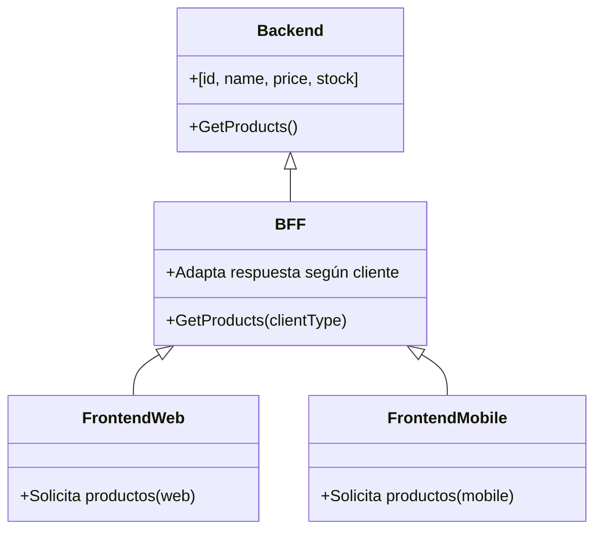
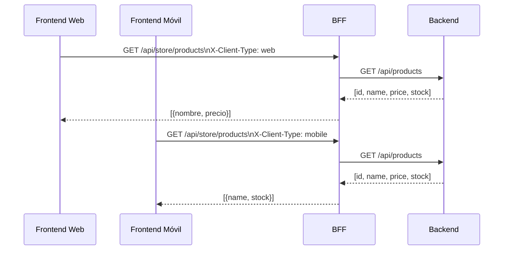
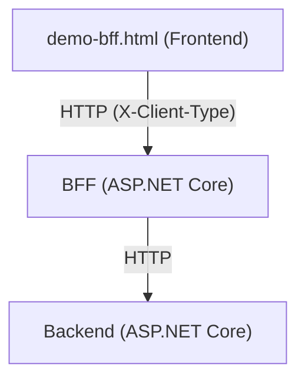
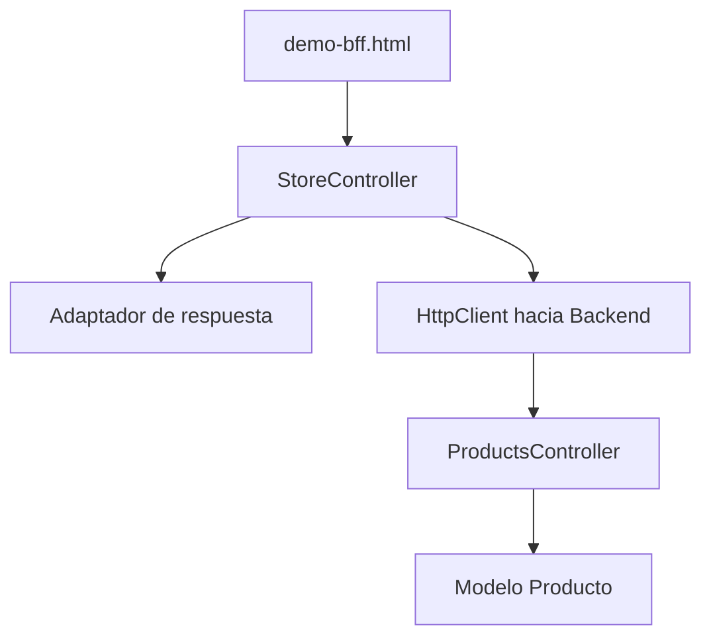

# UnisabanaArq1Grupo2PatronesActividad2

## Presentación de la Actividad

**Asignatura:** Arquitectura de Software  
**Profesor:** Daniel Orlando Saavedra Fonnegra

**Integrantes del grupo:**
- Pablo Andrés Melo García
- Camilo Andres Padilla Garcia
- Edison Kenneth Campos Avila
- Cristian Alonso Cardona Vega
- Jorge Andres Ayala Valero
- John Harold Diaz Gonzalez

---

## Demo: Patrón Backend For Frontend (BFF) en .NET

Este demo implementa el patrón arquitectónico Backend For Frontend (BFF) usando ASP.NET Core. Incluye dos proyectos:

- **Backend**: API REST genérica que expone información completa de productos.
- **BFF**: API REST que consume el backend y adapta la respuesta para el frontend web o móvil, mostrando solo la información relevante.
- **Frontend (HTML)**: Página demo que permite probar y visualizar el flujo BFF y la adaptación de datos.

---

### Diagrama de clases



#### Diagrama de secuencia



### Diagrama de despliegue



### Diagrama de componentes



---

### Estructura del demo

```
BFFDemo/
├── Backend/   # API genérica de productos
├── BFF/       # Backend For Frontend (adapta la respuesta)
└── BFFDemo/   # Frontend HTML para pruebas
```

---

### Ejecución rápida

1. Abre dos terminales.
2. En la primera terminal, ejecuta el backend:
   ```bash
   dotnet run --project ./Backend/Backend.csproj
   ```
3. En la segunda terminal, ejecuta el BFF:
   ```bash
   dotnet run --project ./BFF/BFF.csproj
   ```
4. Abre el archivo `BFFDemo/demo-bff.html` en tu navegador.

---

### Prueba visual y didáctica

- Selecciona el tipo de cliente (web o móvil) y haz clic en "Cargar productos".
- La página muestra:
  - La URL y el header enviados al BFF
  - El JSON crudo de la respuesta
  - La tabla adaptada según el tipo de cliente
  - Una explicación visual del flujo BFF

---

### Prueba de endpoints (Swagger)

- **Backend:** [http://localhost:5125/swagger](http://localhost:5125/swagger)
- **BFF:** [http://localhost:5207/swagger](http://localhost:5207/swagger)

**Ejemplo de respuesta del backend:**
```json
[
  { "Id": 1, "Name": "Laptop", "Price": 1200, "Stock": 10 },
  { "Id": 2, "Name": "Mouse", "Price": 25, "Stock": 100 },
  { "Id": 3, "Name": "Keyboard", "Price": 45, "Stock": 50 }
]
```

**Ejemplo de respuesta del BFF:**
- Si `X-Client-Type: web`:
```json
[
  { "Nombre": "Laptop", "Precio": 1200 },
  { "Nombre": "Mouse", "Precio": 25 },
  { "Nombre": "Keyboard", "Precio": 45 }
]
```
- Si `X-Client-Type: mobile`:
```json
[
  { "Name": "Laptop", "Stock": 10 },
  { "Name": "Mouse", "Stock": 100 },
  { "Name": "Keyboard", "Stock": 50 }
]
```

---

### ¿Qué demuestra este demo?

- El **Backend** expone todos los datos, sin preocuparse por la presentación.
- El **BFF** adapta la respuesta según el header `X-Client-Type` enviado por el cliente:
  - Si es web: solo nombre y precio (en español).
  - Si es móvil: solo nombre y stock (en inglés).
- Permite desacoplar la lógica de presentación y facilitar la evolución independiente de frontends.
- El frontend HTML permite ver el flujo completo y comparar respuestas.

---

### Ventajas del patrón BFF
- Adaptación de datos y lógica para cada frontend.
- Mejor experiencia de usuario (respuestas más simples y rápidas).
- Seguridad: el frontend no accede directamente al backend genérico.

### Desventajas
- Mayor complejidad operativa (más servicios a mantener).
- Posible duplicación de lógica entre BFFs si hay varios frontends.

---

### Bibliografía
- [Microsoft Docs: API Gateway pattern](https://learn.microsoft.com/en-us/azure/architecture/patterns/api-gateway)
- [Martin Fowler: BFF](https://martinfowler.com/bliki/BackendForFrontend.html)

---